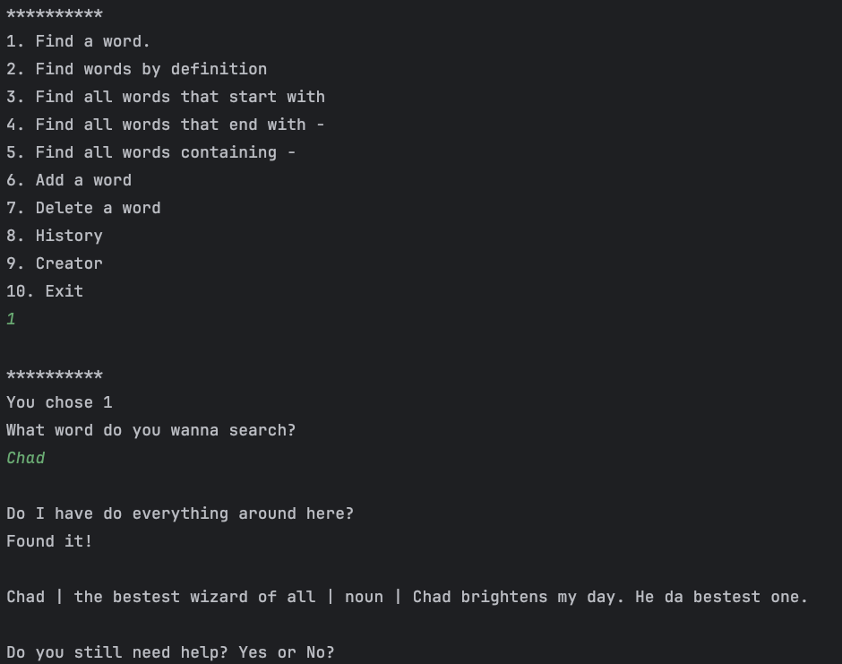
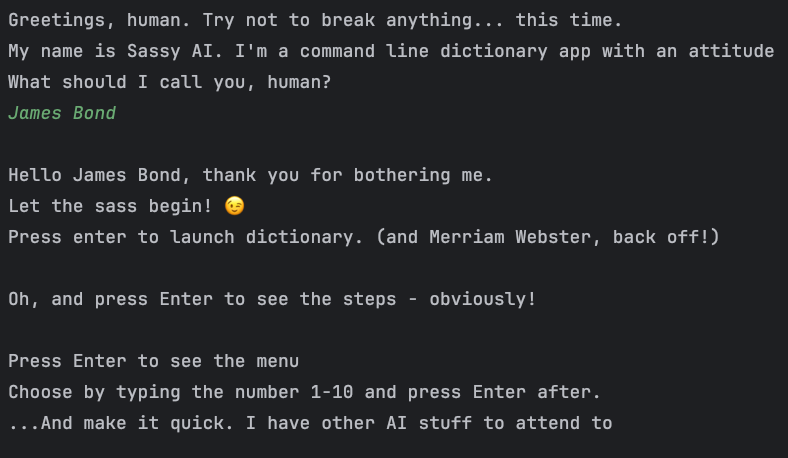
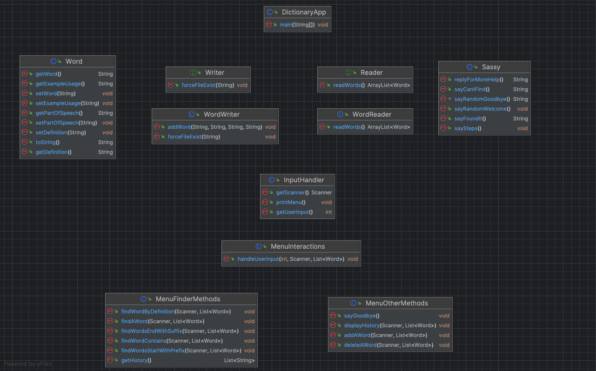
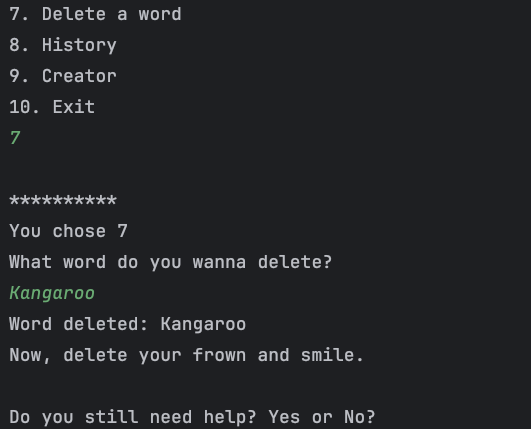
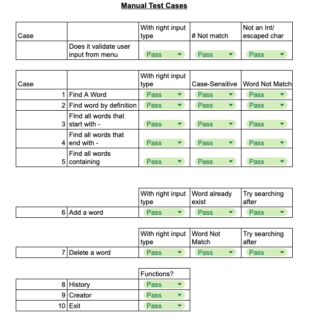

# Sassy Dictionary App

---

# Intro

This project was completed late Mar 2024 as part of General Assembly's Bootcamp, during Week 7 in our course. The application utilizes the concepts learned in Java, such as data types, variables, control flow, loops, methods, scopes, arrays, ArrayLists, Object-Oriented Programming (OOP), interfaces, exception handling, file I/O, and the Java Stream API.

---

# Overview

Sassy AI Dictionary is a command line app written with Java that has an attitude and talks back to users.. The user is able to interact with a simple dictionary by typing commands and receiving text-based outputClasses.




## Features

The app has the following core features:

1. Load a dictionary from a text file containing word information.

2. Display a menu of 10 options for users:

- Allow users to search for words and display their definitions
- Enable users to add new words and definitions to the dictionary
- Provide the ability to remove words and their definitions from the dictionary.

3. Save the updated dictionary back to the text file.

## User Experience Lens

To allow for a more fun user experience, the app parodies AI “trained” on sassy responses (displayed by a math.random) to randomly show sassy responses to the user. Also, as Sassy AI runs in the console without a graphical user interface (GUI), in the responses Sassy provides, I start and end with a “\n” to allow breaks in the text for easier readability
\n for accessibility easier to read.



For ease of navigation, instead of having to re-run the app each time to run additional commands on the Dictionary, we have the menu persist with the while(true) loop. At the end, the user is asked if they still need help, and if they still need help- they can type Yes, and code loops again to display the menu of options that user can interact with.


---

# Design

## Class Structure



### Dictionary App.java

This is the entry point of the application, where the methods defined in other classes are called.

### interfaces package

This package contains interfaces for the `WordReader` and `WordWriter` class. In both respectively, we create the method body for `forceFileExist` and the `readWords` method. This is then implemented in our two classes, and allows for extendability should we have other WordReaders and WordWriters down the line.

### domain package

This package is intended for the core classes of the application.

- `Word` is where we define the attributes of the word instances.
- `WordWriter` is where we check if the dictionary.txt file exists (and if not creates it). Additionally, it also contains the `addWord` method that appends new words to the txt file
- `WordReader` is where we read the txt file using `FileReader` and `BufferedReader` (which allows us to then read line by line).
- `MenuInteraction` is where the main menu of options is displayed and we process the user input. We use a try/catch to validate if user input is an integer. The return -1 is returned if the input is not an integer, in which case the while (true) loop in my `DictionaryApp` restarts and displays the menu again.

### utils package

This package contains utility classes.

- `InputHandler` contains the switch loop to process the user choices, first “echoing the user choice” so that user can get visual confirmation of their choice. Then it calls that option's specific method.
- `MenuFinderMethods` and `MenuOtherMethods` are where the methods for each option in the switch loop are defined. For separation of concerns, they are separated into two classes- one to define all the finder methods and other to define the other methods (like adding, deleting, and history).

---

# Functionality

## In-Memory Data and File

The `DictionaryApp` while (true) loop includes the following line below at the start. This way, when the application starts, it should read all the words, definitions, parts of speech, and example usages from the dictionary.txt file and load them into an ArrayList (in memory). Also, whenever a user adds or deletes a word from the dictionary, the application should update both the in-memory data structure (e.g., ArrayList) and the dictionary.txt file on disk.

This approach ensures that word searches and other operations are performed on the in-memory data, rather than reading from the file each time, resulting in faster performance.

```
List<Word> listOfWords = wordReader.readWords();
```

## Menu Methods Validation

To implement the menu methods, I utilize the Java Stream API and its various methods, such as `filter` and `collect (toList())`. Validation is also added in the menu methods.

To filter, we use the lambda return based on matches to the search term. The `.equalsIgnoreCase` allows you to compare strings without considering their case directly. These were used in the return conditional of my stream filters.

The if/else in those methods allow the user to be notified if the method is unable to be completed if the search term doesn’t exist (or in the case of adding word- if the word already exists).
For example, when we try finding a word, we can see if a search term does not exist by seeing if that filtered list is empty, and return an error message to the user, else search and return the results. Another example is in the delete list, where we check the size of the filtered list without the deleted word, and if it’s equal to the existing list, then the deleted word doesn’t exist.

```
if (listOfWords.size() == filteredWordsWithoutDeleted.size())
```



---

# What I learned

## Refining Foundational Knowledge

### Static vs non-static

We use non-static methods if we may have multiple instances of that class. Non-static methods do require you to create a new instance of the class to call the method on it. newClasInstance.method()

Static methods are called with the class name. ClassName.method()
Additionally, if a static method is used with a non-static variable - that is going to create an error due to compatibility issues. To resolve that, you will want to make your variables static or just call them within that method.

### Paramaters

Parameters allow for more code flexibility, for example if we have multiple scanners or choices, i.e. if we were to do test cases to assign different values to those variables.
When writing a method within parentheses, we put in the data type and variable names for the parameters that we are using in the method. These parameters are then passed along to other methods
For example, under `MenuFinderMethods`, the `findAWord` method uses parameters.

Note:

- When you define a method, make sure you define the data type.
- When you call a method, you will only have to include the parameter variables.

```
public static void findAWord(Scanner scanner, List<Word> listOfWords)
```

These parameters are then passed along to the `MenuInteractions` switch method

```
MenuFinderMethods.findAWord(scanner, listOfWords);
```

Within the `handleUserInput` on that class, then the parameters are passed again.

```
public static void handleUserInput(int choice, Scanner scanner, List<Word> listOfWords)
```

Then finally in the `DictionaryApp` class, then we assign the values to those parameters

```
List<Word> listOfWords = wordReader.readWords();
int userInput = InputHandler.getUserInput();
Scanner inputScanner = InputHandler.getScanner();
MenuInteractions.handleUserInput(userInput, inputScanner, listOfWords);
```

### Access Modifiers

These help in determining the visibility and usability of methods.

- A method declared as public can be accessed from any other class or package.
- A method declared as private can only be accessed within the same class. For example, in MenuInteractions, I made the `echoChoice` method private as we only need to use that method within that class - to confirm the user’s choice on the console.
- A method that is package private (default when no access modifier is used) is accessible only within the same package. You would not be able to call it outside of the package.
- A method that is protected is accessible within its own package, and also by subclasses (regardless of whether this subclass exists in the same package or not).

## try/catch and return -1

If/else is typically used for checking specific conditions, like when we want to check if say if a variable equals a value, then do something.
Try/catch is more so used when you are not sure what type of exception could occur.

For example, in my `InputHandler` class, the `getUserInput()` not only gets the integer value of the user input but has a try/catch to account for any possible exceptions such as the user not entering an integer, etc.
We use the -1 return as a “flag” so that if an exception occurs in our `DictionaryApp`, it will “continue’ which essentially restart the while(true) loop again and re-displays the list of options.

```
 try {
        int userChoice = scanner.nextInt();
        scanner.nextLine();
        return userChoice;
    } catch (Exception e) {
        System.out.println("You've put an invalid input");
        scanner.next();
      return -1;
    }
```

## scanner.nextLine()

`scanner.nextInt()` reads only what it perceives as an int and nothing else
For example, when the user enters which number (int) of the menu option they want, after `scanner.nextInt()`, the input buffer has anything after the int including \n character from the user hitting Enter.
`nextLine()` reads character after input buffer- essentially consuming the enter `\n` character (aka clears out the input buffer so it’s cleared up).

Similarly `scanner.next()` reads the input until it encounters whitespace (space, tab, newline, etc.) or the end of the input. In our try/catch statement, the `scanner.next()` helps to consume the `\n` character to prevent the infinite looping error whereby the `\n` remains in memory- so the catch statement forces the loop to iterate over and over.

## while (true)

A while (true) loop in Java continuously executes the block of code within its body until a break statement is encountered. This is what allows the menu to persist, and additionally it will read the dictionary.txt with each loop. Lastly, in `DictionaryApp`, the user is prompted if they still need help or not. If they type No, this will exit the loop.

## try/with

RAII (Resource Acquisition Is Initialization) is a concept where we open resources at the same time we open resources at the same time as initializing objects, ensuring that resource management is tied to the lifetime of objects.
With a try/with resources are opened within the try block and automatically closed at the end of the code block located in the brackets of the try block.

---

# Thinking ahead

## Edge cases

Once my project was done, I ran the following manual tests primarily to see if the word exists, and if the search is case sensitive, and for delete and add (if I can still search it).



For future iterations, I would have considered more detailed edge cases down the road and built additional exception code. These edge cases could be: escaped characters, and also putting validation in place to prevent user errors such as not allowing them to add a blank word which can cause arrayindexoutofbound errors.

## Potential add-ons

I could add code to allow users to confirm selection, and if they picked something wrong- allow them to return to the main menu to choose the correct option they want to. Logic can also be added to allow the user to keep trying to search if the search term does not match when searching (versus how our current model only allows them to type for more help and have the menu re-displayed to then search again). Both add-ons would allow for more efficient user app-interactions.
